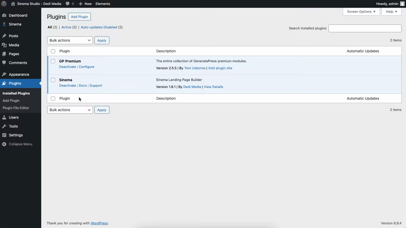
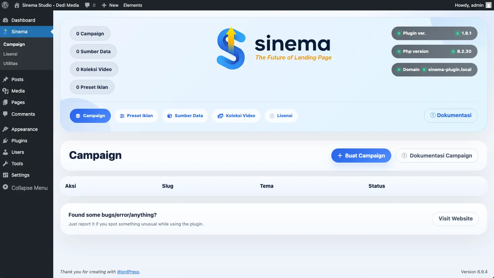

  

  
  
  

<h1 align="center">Sinema</h1>

  Plugin WordPress untuk membangun landing page campaign dengan workflow yang lebih cepat, lebih rapi, dan lebih siap dipakai untuk kebutuhan operasional yang konsisten.

  <a href="https://sinema.my.id/">Registrasi / Login / Pembelian</a> •
  <a href="https://www.facebook.com/dedimedia">Facebook Dedi Media</a>

  
  

Repository ini adalah halaman publik resmi untuk informasi produk, dokumentasi singkat, dan akses layanan `Sinema`.

## Ringkasnya

`Sinema` membantu Anda menyiapkan landing page campaign langsung dari WordPress dengan alur yang lebih cepat dan lebih terstruktur, tanpa perlu membangun halaman berulang kali dari nol.

## Dibuat Untuk Traffic Berbayar

`Sinema` cocok digunakan untuk kebutuhan landing page yang mengandalkan traffic dari `Facebook Ads`, `Meta Ads`, dan `Google Ads`.

Dengan workflow yang lebih rapi, Anda bisa menyiapkan halaman campaign yang lebih cepat tayang, lebih konsisten, dan lebih mudah disesuaikan dengan kebutuhan iklan yang sedang dijalankan.

  
  
  

## Mulai Dari Sini

Jika Anda ingin mengetahui akses produk, registrasi user, atau pembelian plugin, gunakan tautan resmi berikut:

- `https://sinema.my.id/`

  

  Registrasi, login, dan akses layanan resmi melalui <a href="https://sinema.my.id/">sinema.my.id</a>

## Kenapa Sinema

Membangun landing page campaign secara manual berulang kali akan memakan waktu, sulit dirapikan, dan rawan menghasilkan workflow yang tidak konsisten.

`Sinema` membantu menyederhanakan proses itu melalui panel admin WordPress, sehingga Anda bisa:

- membuat landing page campaign lebih cepat
- mengelola struktur campaign dari satu panel admin
- memakai tema siap pakai untuk skenario yang berbeda
- menjaga workflow tetap konsisten saat kebutuhan bertambah

## Nilai Utama

<table>
  <tr>
    <td><strong>Kecepatan</strong></td>
    <td>Lebih cepat menyiapkan campaign baru tanpa mengulang setup dari nol.</td>
  </tr>
  <tr>
    <td><strong>Kerapian</strong></td>
    <td>Lebih rapi dalam mengelola konten, source, dan struktur halaman campaign.</td>
  </tr>
  <tr>
    <td><strong>Konsistensi</strong></td>
    <td>Lebih konsisten saat menangani banyak kebutuhan campaign dalam workflow yang sama.</td>
  </tr>
  <tr>
    <td><strong>Praktis</strong></td>
    <td>Workflow utama berjalan langsung dari dashboard WordPress.</td>
  </tr>
</table>

## Bantu Iklan Lebih Terkontrol

Saat menjalankan iklan, halaman yang lambat disiapkan atau workflow yang berantakan sering membuat biaya terasa terbuang percuma.

`Sinema` membantu Anda bekerja lebih terarah agar setup campaign lebih cepat, struktur landing page lebih rapi, dan proses optimasi lebih mudah dijalankan. Tujuannya sederhana: membantu Anda mengurangi potensi boncos karena alur kerja yang tidak efisien.

  
  
  

## Siapa Yang Cocok Menggunakan Sinema

<table>
  <tr>
    <td><strong>WordPress User</strong></td>
    <td>Untuk pengguna WordPress yang membutuhkan landing page campaign lebih cepat.</td>
  </tr>
  <tr>
    <td><strong>Tim Operasional</strong></td>
    <td>Untuk tim yang ingin workflow campaign lebih terstruktur dan mudah dijalankan.</td>
  </tr>
  <tr>
    <td><strong>Campaign Builder</strong></td>
    <td>Untuk pengguna yang sering membuat halaman campaign dengan pola berulang.</td>
  </tr>
  <tr>
    <td><strong>Traffic Manager</strong></td>
    <td>Untuk pihak yang ingin mengelola campaign dari dashboard admin yang lebih praktis.</td>
  </tr>
</table>

## Cocok Untuk

- pembuatan landing page berbasis campaign
- workflow operasional yang membutuhkan halaman cepat tayang
- pengelolaan banyak campaign dari satu dashboard
- kebutuhan setup yang ingin lebih terstruktur dan mudah diulang

## Fitur Utama

<table>
  <tr>
    <td><strong>Campaign Management</strong></td>
    <td>Manajemen campaign langsung dari dashboard WordPress.</td>
  </tr>
  <tr>
    <td><strong>Ready-to-Use Themes</strong></td>
    <td>Dukungan beberapa tema landing page siap pakai.</td>
  </tr>
  <tr>
    <td><strong>Data Source Control</strong></td>
    <td>Pengelolaan data source sesuai kebutuhan campaign.</td>
  </tr>
  <tr>
    <td><strong>Asset Support</strong></td>
    <td>Dukungan asset tambahan untuk campaign tertentu.</td>
  </tr>
  <tr>
    <td><strong>License Integration</strong></td>
    <td>Integrasi lisensi melalui backend.</td>
  </tr>
  <tr>
    <td><strong>Efficient Workflow</strong></td>
    <td>Workflow yang lebih efisien untuk pembuatan halaman campaign.</td>
  </tr>
</table>

## Mendukung Strategi Monetisasi

Selain membantu kebutuhan landing page campaign, `Sinema` juga relevan untuk workflow yang memanfaatkan monetisasi berbasis iklan seperti `Adsense`.

Dengan pengaturan halaman yang lebih terstruktur, Anda bisa lebih mudah menyiapkan alur konten, penempatan elemen, dan skenario campaign yang mendukung pengelolaan traffic secara lebih rapi.

  
  
  

## Tema yang Didukung

  
  
  
  
  

## Cara Mendapatkan Sinema

Source code plugin `Sinema` tidak dibuka untuk publik dan dikelola secara privat.

Jika Anda berminat menggunakan plugin ini, silakan akses:

- `https://sinema.my.id/`

Melalui situs tersebut Anda dapat:

- registrasi akun baru
- login sebagai user
- melihat informasi produk dan layanan
- mengikuti alur pembelian atau aktivasi yang tersedia

## Alur Singkat

1. Akses `https://sinema.my.id/`
2. Registrasi atau login akun Anda
3. Ikuti alur pembelian atau aktivasi yang tersedia
4. Gunakan plugin sesuai lisensi dan workflow campaign Anda

## Screenshot

Berikut beberapa tampilan utama dari workflow `Sinema`.

### Aktivasi Lisensi

  

Halaman aktivasi lisensi untuk mengisi `license key`, `backend URL`, dan memeriksa status plugin sebelum mulai membuat campaign.

### Daftar Campaign

  

Panel daftar campaign dengan aksi utama seperti edit, duplicate, analytics, delete, serta akses cepat untuk membuat campaign baru.

### Campaign Builder

  

Wizard campaign membantu pengaturan nama, slug, tema, source, monetisasi, dan finalisasi halaman dalam alur yang lebih terstruktur.

### Preview Landing

  

Contoh hasil landing page dengan tampilan modern yang siap dipakai sesuai skenario campaign yang dipilih.

## Akses Resmi

- Registrasi / login / pembelian: `https://sinema.my.id/`
- Author: `Dedi Media`
- Facebook Author: `https://www.facebook.com/dedimedia`

## Dokumentasi Publik

Panduan penggunaan publik akan diperbarui bertahap melalui repository ini dan situs resmi.

- Situs resmi: `https://sinema.my.id/`

## Kontak Author

- Facebook Dedi Media: `https://www.facebook.com/dedimedia`

## FAQ Singkat

**Apakah source code plugin ini tersedia untuk publik?**

Tidak. Source code utama plugin dikelola secara privat.

**Di mana saya bisa registrasi atau login?**

Melalui situs resmi: `https://sinema.my.id/`

**Apakah screenshot di halaman ini sama dengan yang muncul di popup detail plugin?**

Mengacu pada materi visual yang sama. Untuk README publik, file `webp` statis lebih disarankan agar tampil lebih ringan dan stabil di GitHub.

**Di mana saya bisa mengikuti informasi resmi dari author?**

Melalui halaman Facebook Dedi Media: `https://www.facebook.com/dedimedia`

## Catatan

- Repository ini difokuskan untuk dokumentasi publik dan informasi produk.
- Repository source code utama plugin tetap bersifat privat.
