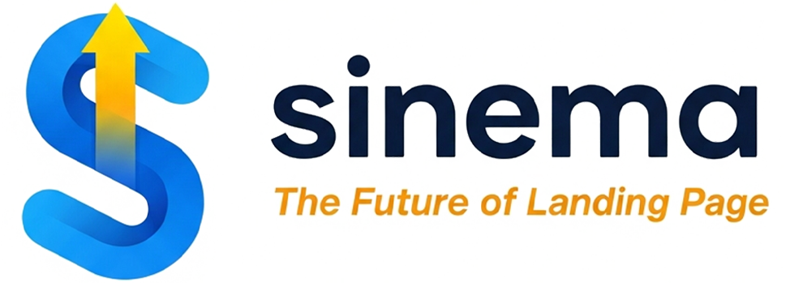

  

  
  
  

<h1 align="center">Sinema</h1>

  Plugin WordPress untuk membangun landing page campaign dengan workflow yang lebih cepat, lebih rapi, dan lebih siap dipakai untuk kebutuhan operasional harian.

  <a href="https://sinema.my.id/">Registrasi / Login / Pembelian</a> •
  <a href="https://www.facebook.com/dedimedia">Facebook Dedi Media</a>

  
  

Repository ini adalah halaman publik resmi untuk informasi produk, dokumentasi singkat, dan akses ke layanan `Sinema`.

## Ringkasnya

`Sinema` membantu Anda menyiapkan landing page campaign langsung dari WordPress dengan alur yang lebih cepat dan lebih terstruktur, tanpa harus membangun halaman berulang kali dari nol.

## Kenapa Sinema

Membangun landing page campaign secara manual berulang kali akan memakan waktu, sulit dirapikan, dan rawan tidak konsisten.

`Sinema` membantu menyederhanakan proses itu melalui panel admin WordPress, sehingga Anda bisa:

- membuat landing page campaign lebih cepat
- mengelola struktur campaign dari satu tempat
- memakai tema siap pakai untuk skenario yang berbeda
- menjaga alur kerja tetap konsisten saat project bertambah

## Nilai Utama

- Lebih cepat tayang untuk campaign baru
- Lebih rapi dalam pengelolaan konten, source, dan struktur halaman
- Lebih konsisten saat menangani banyak kebutuhan campaign
- Lebih praktis karena workflow utama berjalan dari dashboard WordPress

## Siapa Yang Cocok Menggunakan Sinema

- pengguna WordPress yang membutuhkan landing page campaign lebih cepat
- tim operasional yang ingin workflow lebih terstruktur
- pengguna yang sering membuat halaman campaign dengan pola berulang
- pihak yang ingin mengelola campaign dari dashboard admin yang lebih praktis

## Cocok Untuk

- pembuatan landing page berbasis campaign
- workflow operasional yang membutuhkan halaman cepat tayang
- pengelolaan banyak campaign dari satu dashboard
- kebutuhan setup yang ingin lebih terstruktur dan berulang

## Fitur Utama

- Manajemen campaign langsung dari dashboard WordPress
- Dukungan beberapa tema landing page siap pakai
- Pengelolaan data source sesuai kebutuhan campaign
- Dukungan asset tambahan untuk campaign tertentu
- Integrasi lisensi melalui backend
- Alur kerja yang lebih efisien untuk pembuatan halaman campaign

## Tema yang Didukung

- Artikel
- FakeHub
- Mediafire
- Playstore
- Video

## Alur Singkat

1. Akses `https://sinema.my.id/`
2. Registrasi atau login akun Anda
3. Ikuti alur pembelian atau aktivasi yang tersedia
4. Gunakan plugin sesuai lisensi dan workflow campaign Anda

## Screenshot

Berikut beberapa tampilan utama dari workflow `Sinema`.

### Aktivasi Lisensi

  

Halaman aktivasi lisensi untuk mengisi `license key`, `backend URL`, dan memeriksa status plugin sebelum mulai membuat campaign.

### Daftar Campaign

  

Panel daftar campaign dengan aksi utama seperti edit, duplicate, analytics, delete, dan akses cepat untuk membuat campaign baru.

### Campaign Builder

  

Wizard campaign membantu pengaturan nama, slug, tema, source, monetisasi, dan finalisasi halaman dalam alur yang lebih terstruktur.

### Preview Landing

  

Contoh hasil landing page dengan tampilan modern yang siap dipakai untuk campaign sesuai skenario yang dipilih.

## Akses Resmi

- Registrasi / login / pembelian: `https://sinema.my.id/`
- Author: `Dedi Media`
- Facebook Author: `https://www.facebook.com/dedimedia`

## Cara Mendapatkan Sinema

Source code plugin `Sinema` tidak dibuka untuk publik dan dikelola secara privat.

Jika Anda berminat menggunakan plugin ini, silakan akses:

- `https://sinema.my.id/`

Melalui situs tersebut Anda dapat:

- registrasi akun baru
- login sebagai user
- melihat informasi layanan
- mengikuti alur pembelian atau aktivasi yang tersedia

## Dokumentasi Publik

Panduan penggunaan publik akan diperbarui bertahap melalui repository ini dan situs resmi.

- Situs resmi: `https://sinema.my.id/`

## Mulai Dari Sini

Jika Anda ingin mengetahui akses produk, registrasi user, atau pembelian plugin, gunakan tautan resmi berikut:

- `https://sinema.my.id/`

## Kontak Author

- Facebook Dedi Media: `https://www.facebook.com/dedimedia`

## FAQ Singkat

**Apakah source code plugin ini tersedia untuk publik?**

Tidak. Source code utama plugin dikelola secara privat.

**Di mana saya bisa registrasi atau login?**

Melalui situs resmi: `https://sinema.my.id/`

**Apakah screenshot di halaman ini sama dengan yang muncul di popup detail plugin?**

Ya. Screenshot produk juga disediakan melalui metadata `info.json` updater resmi Sinema.

**Di mana saya bisa mengikuti informasi resmi dari author?**

Melalui halaman Facebook Dedi Media: `https://www.facebook.com/dedimedia`

## Catatan

- Repository ini difokuskan untuk dokumentasi publik dan informasi produk.
- Repository source code utama plugin tetap bersifat privat.
